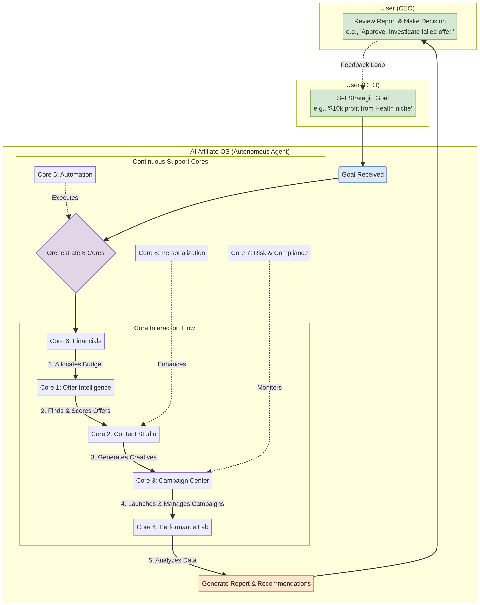
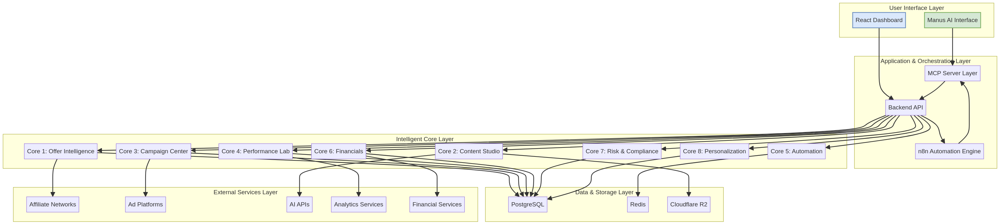

""
# The Vision for Full Automation: An 8-Core AI Affiliate OS

**Date:** December 9, 2025  
**Author:** Manus AI  
**Objective:** To evolve the affiliate marketing system from a powerful tool into a fully autonomous, self-optimizing, and profitable business engine by enhancing the existing 5 cores and introducing 3 new intelligent cores.

---

## 1. The Next Evolution: From Tool to Autonomous Agent

Our current 5-core system is a powerful **tool** that automates many tasks. However, the ultimate goal is to create an **autonomous agent** that can run the entire business with minimal human oversight. To achieve this, we need to fill the remaining strategic gaps and empower the system to make higher-level decisions.

This document outlines the transition from 5 cores to a comprehensive **8-core architecture**, creating a true AI-Powered Affiliate Marketing Operating System (OS).

### The 3 New Cores for Full Automation:

1.  **Financial Intelligence Engine:** Manages budgets, forecasts profitability, and optimizes for financial KPIs, not just marketing metrics.
2.  **Risk & Compliance Engine:** Proactively monitors for ad account, affiliate network, and brand safety risks to ensure long-term business continuity.
3.  **Personalization Engine:** Dynamically tailors content and user experiences to specific audience segments, dramatically increasing conversion rates.

---

## 2. The Enhanced 8-Core Architecture

This new architecture represents a complete, self-sufficient system.

```
┌─────────────────────────────────────────────────────────┐
│                  MANUS AI (Strategic Oversight)          │
└─────────────────────────────────────────────────────────┘
                            │
                            ▼
┌─────────────────────────────────────────────────────────┐
│                  AUTONOMOUS AI AFFILIATE OS              │
│                                                         │
│   [Core 1: Offer Intelligence] <=> [Core 6: Financials]   │
│   [Core 2: Content Studio]     <=> [Core 8: Personalization]│
│   [Core 3: Campaign Center]    <=> [Core 7: Risk/Compliance]│
│   [Core 4: Performance Lab]    <=> [Core 5: Automation]    │
│                                                         │
└─────────────────────────────────────────────────────────┘
                            │
                            ▼
┌─────────────────────────────────────────────────────────┐
│                 EXTERNAL INTEGRATIONS                    │
│  Networks │ Ad Platforms │ Analytics │ Financials │ AI APIs │
└─────────────────────────────────────────────────────────┘
```

---

## 3. Detailed Breakdown of the 8 Cores

Here is a deep dive into the 5 enhanced cores and the 3 new cores.

### **🧠 Core #1: Offer Intelligence Engine (Enhanced)**

*   **What It Is:** Your internal market research and deal-sourcing department.
*   **Enhancements:**
    *   **Competitor Intelligence:** Now actively scrapes competitor landing pages and ads to identify their top offers and traffic sources.
    *   **Market Saturation Analysis:** Uses Google Trends and keyword search volume to estimate niche saturation, avoiding overly competitive products.
    *   **Predictive Scoring:** Instead of just scoring current metrics, it uses historical data to forecast an offer's 90-day earnings potential.
*   **Benefit:** You don't just find good offers; you find **undervalued offers in unsaturated niches** with high future potential, giving you a significant first-mover advantage.

### **🎨 Core #2: Content Studio (Enhanced)**

*   **What It Is:** Your automated, multi-format creative agency.
*   **Enhancements:**
    *   **Brand Voice & Style Guide:** You can now define a brand voice (e.g., "witty and informal") and a visual style guide. All AI-generated content will adhere to these rules.
    *   **Automated Creative Refresh:** The system automatically detects "creative fatigue" (dropping CTR) and generates a new batch of creatives without any manual command.
    *   **Multi-lingual Content:** Can generate content in multiple languages to target different geographic markets.
*   **Benefit:** Your brand remains consistent and your ads stay fresh automatically, leading to higher engagement and lower ad costs.

### **🚀 Core #3: Campaign Center (Enhanced)**

*   **What It Is:** Your tireless, 24/7 media buyer.
*   **Enhancements:**
    *   **Automated Budget Allocation:** Instead of just scaling/pausing, it now shifts budget between platforms (e.g., from a poorly performing Meta campaign to a high-performing Google campaign) in real-time.
    *   **Automated Audience Discovery:** Actively tests new audiences and interest groups on ad platforms, automatically identifying and scaling into new customer segments.
    *   **Full Funnel Integration:** Now includes email marketing campaigns, creating a unified view of both paid and owned media channels.
*   **Benefit:** Your ad spend is always allocated to the most profitable channel and audience, maximizing your overall return without manual adjustments.

### **📈 Core #4: Performance Lab (Enhanced)**

*   **What It Is:** Your data science and business intelligence department.
*   **Enhancements:**
    *   **Root Cause Analysis:** When performance drops, the AI automatically investigates and provides a probable cause (e.g., "ROAS dropped 30% after competitor X launched a new ad").
    *   **Cohort Analysis:** Tracks user cohorts to understand the long-term value of customers acquired from different campaigns and offers.
    *   **SEO & Content Gap Analysis:** Identifies "low-hanging fruit" keywords and content topics that your competitors are ranking for but you are not.
*   **Benefit:** You get actionable insights, not just data. The system tells you *why* things are happening and what to do about it.

### **⚡ Core #5: Automation Engine (Enhanced)**

*   **What It Is:** The central nervous system of the entire operation.
*   **Enhancements:**
    *   **Goal-Oriented Workflows:** Instead of just triggering pre-built workflows, you can now give it goals like, "Achieve a 3.5x ROAS on the new ClickBank offer." The engine will then orchestrate all other cores to achieve that goal.
    *   **Self-Healing Processes:** If an API integration fails (e.g., Hotmart is down), the engine will automatically pause dependent workflows and retry, sending an alert only if the issue persists.
    *   **Dynamic Resource Management:** Can automatically scale server resources up or down based on workload (e.g., during a large content generation task).
*   **Benefit:** The system becomes truly goal-driven and resilient, capable of managing its own operations and recovering from common failures.

---

### **💰 Core #6: Financial Intelligence Engine (NEW!)**

*   **What It Is:** Your virtual Chief Financial Officer (CFO).
*   **How It Works:**
    1.  Integrates with your accounting software (e.g., QuickBooks, Xero) and bank accounts.
    2.  Tracks all revenue (from affiliate networks) and all costs (ad spend, software, AI API usage).
    3.  Provides real-time Profit & Loss (P&L) statements.
    4.  Manages campaign budgets based on overall business profitability, not just campaign-level ROAS.
    5.  Generates cash flow projections and profitability forecasts.
*   **Benefit:** This is the most critical new core. It elevates your decision-making from "Is this campaign profitable?" to "**Is this business profitable and growing sustainably?**" It ensures you never overspend and always focus on the true bottom line.

### **🛡️ Core #7: Risk & Compliance Engine (NEW!)**

*   **What It Is:** Your in-house legal and compliance team.
*   **How It Works:**
    1.  **Ad Account Monitoring:** Scans your ad creatives and landing pages for words or claims that are likely to get your ad accounts flagged or banned (e.g., "guaranteed results," misleading health claims).
    2.  **Affiliate Network Compliance:** Regularly checks the terms of service for your connected affiliate networks to ensure your promotional methods are compliant.
    3.  **Brand Safety:** Monitors where your ads are being placed to ensure they don't appear next to inappropriate content.
    4.  **Domain Health:** Checks your domain reputation and email deliverability scores to prevent being blacklisted.
*   **Benefit:** This core protects your entire business. An ad account ban can be catastrophic. This engine works 24/7 to prevent it, ensuring the long-term viability of your operations.

### **🎯 Core #8: Personalization Engine (NEW!)**

*   **What It Is:** Your 1:1 marketing and customer experience specialist.
*   **How It Works:**
    1.  **Audience Segmentation:** Uses tracking data to segment your audience based on demographics, interests, and on-site behavior (e.g., "visited pricing page but didn't buy").
    2.  **Dynamic Content:** Automatically customizes landing page content for different segments. A visitor from a "best budget software" search might see a different headline than one from a "premium enterprise solution" search.
    3.  **Personalized Email Flows:** Sends different email sequences based on how a subscriber joined your list or what links they've clicked.
    4.  **Retargeting Logic:** Creates hyper-targeted retargeting campaigns (e.g., show a testimonial ad to someone who watched 50% of the product video).
*   **Benefit:** This is the key to breaking through the 3-5% conversion rate ceiling. By delivering the right message to the right person at the right time, you can dramatically increase conversion rates and customer lifetime value.

---

## 4. The New User Journey: From Operator to CEO

With the 8-core system, your role fundamentally changes.

**Old Journey (You as the Operator):**
1.  Check Discovery for offers.
2.  Manually approve an offer.
3.  Click "Generate Content."
4.  Review the content.
5.  Click "Create Landing Page."
6.  Click "Launch Campaign."
7.  Manually monitor analytics.
8.  Manually tweak campaign settings.

**New Journey (You as the CEO):**
1.  **Set a Strategic Goal:** "This month, I want to generate $10,000 in profit from the Health & Fitness niche."
2.  **The AI Takes Over:**
    *   **Financial Core** allocates a budget.
    *   **Offer Core** finds the top 3 offers in that niche.
    *   **Content Core** generates creatives for all 3.
    *   **Landing Page Core** builds pages.
    *   **Campaign Core** launches campaigns.
    *   **Risk Core** ensures everything is compliant.
    *   **Personalization Core** tailors content to audience segments.
    *   **Performance Core** tracks results.
    *   **Automation Core** orchestrates everything.
3.  **Receive a Report:** At the end of the week, you get a report: "We are on track to exceed your goal. Offer A is performing at 4.2x ROAS. I have scaled its budget by 30%. Offer C is underperforming and has been paused. Do you approve this summary?"
4.  **Make a Strategic Decision:** You reply, "Yes, proceed. Also, investigate why Offer C failed."

Your job shifts from tactical execution to strategic direction. You are the conductor, and the 8-core orchestra plays the music.

---

## 5. Next Steps: Implementation

This 8-core vision provides the ultimate blueprint for a fully automated, highly profitable affiliate marketing business. The next step is to implement this polished structure.

1.  **Update Frontend:** Reorganize the dashboard to reflect the new 5-hub topology.
2.  **Update Backend:** Refactor API routes and services to align with the new structure.
3.  **Implement New Cores:** Begin building the Financial, Risk, and Personalization engines.

This is the path to building a true AI-powered business, not just a collection of tools. Let's build it.
""


---

## 6. Visualizing the Autonomous Journey

This diagram illustrates your new role as the CEO of the AI Affiliate OS. You set the strategy, and the autonomous agent handles the execution.



## 7. Visualizing the 8-Core System Architecture

This diagram shows how all the layers and cores of the system interact, from the user interface down to the external services.


