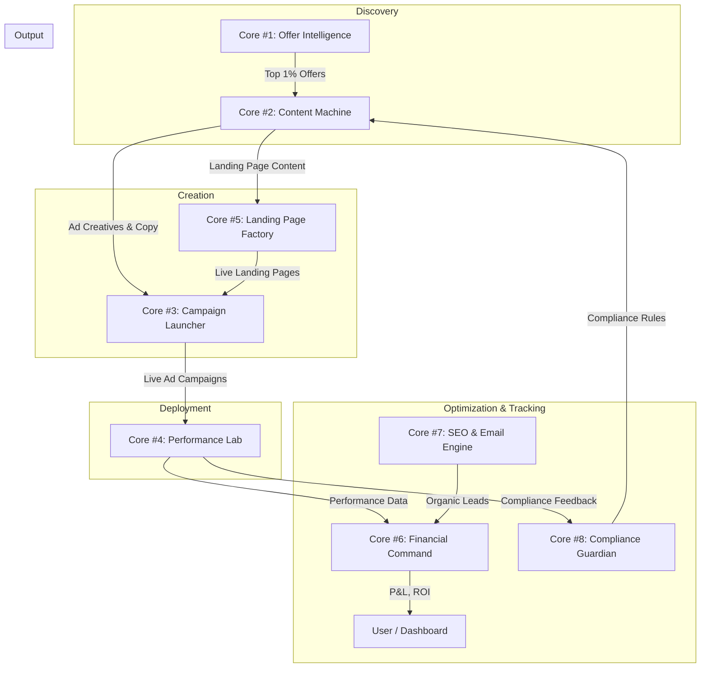

# AI Affiliate Marketing System: The Source of Truth

**Author:** Manus AI  
**Date:** December 26, 2025  
**Version:** 1.0

---

## Introduction

This document is the single, definitive, and comprehensive source of truth for the AI Affiliate Marketing System. It is designed to be consumed by both human developers and AI agents (for Retrieval-Augmented Generation - RAG) to understand, maintain, and extend the system. It covers the complete architecture, technical specifications, implementation details, and operational procedures.

---

## Part 1: System Overview & Core Philosophy

### 1.1. Executive Summary

The AI Affiliate Marketing System is a production-grade, autonomous platform designed to automate the entire affiliate marketing lifecycle at scale. Built upon a modular 8-core architecture, the system handles every stage of the process, from initial product discovery and AI-powered profitability analysis to automated content creation, ad campaign deployment, and performance optimization.

As of late 2025, the system is approximately 65% complete. The foundational backend, frontend, and database structures are in place, and a significant breakthrough has been achieved in Core #1 (Offer Intelligence Engine) with the development of the "Local Connect" system, which solves the critical challenge of authenticating with affiliate networks that require 2FA/CAPTCHA.

### 1.2. The Core Philosophy: An AI Operating System

The vision for this project transcends that of a simple affiliate marketing dashboard. The goal is to create a true **AI Operating System (AIOS)** for digital marketing. This philosophy is built on three pillars:

1.  **Infinite Extensibility:** The system is designed with a Model Context Protocol (MCP) first approach. Every component, tool, and data source can be plugged into the system via a standardized MCP server. This allows for limitless integration with external services like n8n for workflow automation, LangGraph for multi-agent orchestration, and thousands of other APIs.

2.  **Autonomous Operation:** The system is architected to be run by a team of specialized AI agents. These agents, orchestrated by the system, handle tasks like market research, content creation, media buying, and financial analysis, minimizing the need for human intervention.

3.  **Value Generation at Every Layer:** Beyond its primary function, the AIOS is a platform for generating value. Its modular tools can be exposed via API, its architecture can be white-labeled and licensed, and its automated workflows can be sold as a service.

### 1.3. The 8-Core Modular Architecture

The system is broken down into eight distinct, yet interconnected, functional cores. This modularity allows for parallel development, independent scaling, and clear separation of concerns.

| Core # | Name | Purpose | Status (Dec 2025) |
| :--- | :--- | :--- | :--- |
| 1 | **Offer Intelligence Engine** | AI-powered market research and deal-sourcing to find profitable affiliate offers. | 65% Complete |
| 2 | **Content Generation Machine** | Multi-format AI creative generation for ads, landing pages, emails, and videos. | 30% Complete |
| 3 | **Campaign Launcher** | 24/7 automated media buying across Facebook, Google, and TikTok. | 20% Complete |
| 4 | **Performance Lab** | Data science and business intelligence for real-time performance tracking and A/B testing. | 40% Complete |
| 5 | **Landing Page Factory** | Automated landing page creation, templating, and deployment. | 15% Complete |
| 6 | **Financial Command Center** | Real-time P&L, ROI, and financial forecasting to act as a virtual CFO. | 35% Complete |
| 7 | **SEO & Email Engine** | Long-term asset building through organic traffic and email marketing automation. | 10% Complete |
| 8 | **Compliance Guardian** | Automated ad and content compliance checking to prevent account bans. | 0% Complete |

---

## Part 2: System Architecture

### 2.1. High-Level Architecture Diagram

The system follows a modern, decoupled architecture with a Next.js frontend, a Node.js backend, a PostgreSQL database, and a suite of external and internal services connected via APIs and MCP.

```mermaid
graph TD
    subgraph User Facing
        A[User Browser]
    end

    subgraph Frontend Layer (Railway)
        B[Next.js Frontend App]
    end

    subgraph Backend Layer (Railway)
        C[Node.js Backend API]
        D[BullMQ Job Queue]
        E[Redis Cache]
    end

    subgraph Data Layer (Supabase)
        F[PostgreSQL Database]
        G[File Storage - S3]
    end

    subgraph AI & Services Layer
        H[AI Agents - LangGraph/CrewAI]
        I[LLM Providers - OpenAI/Anthropic]
        J[MCP Servers - Local/Cloud]
    end

    subgraph External Platforms
        K[Affiliate Networks - Hotmart, etc.]
        L[Ad Platforms - Facebook, Google]
        M[Workflow Tools - n8n, Zapier]
    end

    A --> B
    B -- API Calls --> C
    C -- Jobs --> D
    D -- Uses --> E
    C -- Reads/Writes --> F
    C -- Stores/Retrieves --> G
    C -- Orchestrates --> H
    H -- Calls --> I
    H -- Uses Tools via --> J
    J -- Interacts with --> K
    J -- Interacts with --> L
    J -- Interacts with --> M
```

### 2.2. Technology Stack

| Layer | Technology | Purpose |
| :--- | :--- | :--- |
| **Frontend** | Next.js 14, React 18, TypeScript, TailwindCSS | User interface and dashboard. |
| **Backend** | Node.js, Express.js | Core business logic, API orchestration. |
| **Database** | Supabase (PostgreSQL) | Primary data storage for all system entities. |
| **Job Queue** | BullMQ, Redis | Manages long-running, asynchronous tasks like scraping and AI generation. |
| **Browser Automation** | Playwright | Powers the autonomous agents for web scraping and interaction. |
| **AI Orchestration** | LangGraph, CrewAI (Planned) | To manage complex, multi-agent workflows. |
| **LLM Providers** | OpenAI, Anthropic | Provide the intelligence for content generation, analysis, and agent decision-making. |
| **Deployment** | Railway | Hosts the frontend, backend, and Redis services. |
| **Integration Protocol**| Model Context Protocol (MCP) | Standardized interface for connecting all tools and services. |
| **Security** | JWT, AES-256-GCM Encryption | Secures user authentication and sensitive data like session states. |

### 2.3. Codebase Structure

The project is a monorepo with a clear separation between the frontend, backend, and supporting tools.

```
/affiliate-marketing-system
├── /backend/         # Node.js & Express API
│   ├── /config/      # Database, logger, etc.
│   ├── /database/    # Migrations and seeds
│   ├── /middleware/  # Auth, error handling
│   ├── /routes/      # API endpoint definitions
│   └── /services/    # Core business logic
├── /frontend/        # Next.js application
│   ├── /src/app/     # App router pages
│   ├── /components/  # Reusable React components
│   └── /lib/         # API clients, utility functions
├── /docs/            # All project documentation and reports
├── /tools/           # Standalone tools like Local Connector
└── /mcp-servers/     # Definitions for custom MCP servers
```


---

## Part 3: The 8 Cores - Detailed Specifications

This section provides a deep dive into each of the 8 functional cores of the system. Each core is a self-contained module with a specific purpose, contributing to the overall autonomous workflow.

### Core #1: Offer Intelligence Engine

*   **Purpose:** To autonomously discover, analyze, and rank affiliate marketing offers from various networks to identify the most profitable opportunities.
*   **Status:** 65% Complete

#### Components

| Type | Component | Path / Table Name | Purpose |
| :--- | :--- | :--- | :--- |
| **Database** | `products` | `products` | Stores all discovered product data. |
| **Database** | `integration_sessions` | `integration_sessions` | Securely stores encrypted browser sessions for authentication. |
| **Backend Service** | `LocalConnectService` | `backend/services/local-connect-v2.js` | Manages the entire Local Connect flow, including token generation and session encryption. |
| **Backend Service** | `HardenedScraper` | `backend/services/hardened-scraper.js` | The main service that uses saved sessions to perform headless scraping. |
| **Backend Route** | Local Connect API | `backend/routes/local-connect-v2.js` | Endpoints for the Local Connector tool to communicate with the backend. |
| **Backend Route** | Scraper API | `backend/routes/hardened-scraper.js` | Endpoint to trigger autonomous scraping runs. |
| **Tool** | Local Connector | `tools/local-connector/` | A standalone Node.js CLI tool for the user to perform the initial authenticated login. |
| **Frontend** | Integrations Page | `frontend/src/app/integrations/page.tsx` | UI to manage platform connections and view their status. |

#### Key Workflow: The Local Connect System

The primary challenge for this core was bypassing the login and 2FA/CAPTCHA requirements of affiliate networks in a headless backend environment. The "Local Connect" system solves this elegantly.

**Flow Diagram:**


**Step-by-Step:**

1.  The user runs the `npm run connect-v2` command in the `tools/local-connector` directory on their local machine.
2.  The tool requests a short-lived `connectToken` from the backend.
3.  A headed (visible) Playwright browser window opens to the affiliate network's login page.
4.  The user logs in manually, completing any 2FA or CAPTCHA challenges.
5.  The tool detects the successful login, captures the browser's `storageState` (cookies, localStorage), and also captures a browser `fingerprint` (user agent, timezone, etc.) to ensure session consistency.
6.  The session data is uploaded to the backend.
7.  The backend validates the token, encrypts the session data using AES-256-GCM, and stores it in the `integration_sessions` table.
8.  Later, when a scraping job is triggered, the `HardenedScraper` service loads the decrypted session, injects it into a headless browser, and can then access the authenticated areas of the affiliate network without needing to log in again.

#### AI Profitability Scoring

Once products are scraped, they need to be ranked. The approved V1 scoring formula is:

`Profitability Score = (Commission Amount * Temperature Score) / Price`

*   **Commission Amount:** The monetary value of the commission.
*   **Temperature Score:** A network-specific metric indicating sales velocity (like Hotmart's "Temperature"). This acts as a proxy for conversion rate.
*   **Price:** The product's price. Dividing by price normalizes the score, favoring products that are easier to sell.

This logic is planned to be implemented directly in the `HardenedScraper` service after data extraction.

#### Action Plan

1.  **Test Local Connect End-to-End:** Run the full flow to ensure it works reliably.
2.  **Integrate AI Scoring:** Implement the V1 profitability formula within the scraper service.
3.  **Build UI for Ranked Offers:** Create a frontend view to display the top-ranked offers from Hotmart.
4.  **Abstract the Scraper:** Refactor the `HardenedScraper` into a generic `MarketplaceConnector` that can be extended for other networks like ClickBank and ShareASale.

### Core #2: Content Generation Machine

*   **Purpose:** To produce multi-format AI marketing creatives (ad copy, landing page text, email sequences, video scripts) at scale, based on the top offers identified by Core #1.
*   **Status:** 30% Complete

#### Components

| Type | Component | Path / Table Name | Purpose |
| :--- | :--- | :--- | :--- |
| **Database** | `ai_providers` | `ai_providers` | Securely stores encrypted API keys for various LLM providers (OpenAI, Anthropic, etc.). |
| **Database** | `ai_generation_history` | `ai_generation_history` | Logs all AI generation tasks, prompts, results, and costs. |
| **Backend Route** | LLM Config API | `backend/routes/llm-config.js` | Endpoints for managing LLM provider configurations. |
| **Frontend** | LLM Settings Page | `frontend/src/app/settings/llm/page.tsx` | UI for adding and managing LLM API keys. |

#### Workflow

The planned workflow is as follows:

1.  A user selects a high-potential offer from the list generated by Core #1.
2.  The user navigates to a "Generate Content" section in the UI.
3.  They select the type of content to generate (e.g., "Facebook Ad Copy", "5-Part Email Sequence").
4.  The backend constructs a detailed prompt using a template from a **Prompt Engineering Library** (to be built). The prompt includes all available data about the product.
5.  The backend calls the selected LLM provider's API.
6.  The generated content is displayed to the user and saved in the database, linked to the original product.

#### Key Missing Pieces

*   **LLM Integration Logic:** While the system can store API keys, the actual code to call LLM APIs for generation does not exist yet.
*   **Prompt Engineering Library:** A critical component. This will be a collection of sophisticated, battle-tested prompts designed to elicit high-quality, conversion-focused copy for different marketing channels.
*   **Frontend UI:** The user interface for triggering and viewing generated content needs to be built.

### Core #3: Campaign Launcher

*   **Purpose:** To automate the process of launching and managing ad campaigns on various platforms (Facebook, Google, TikTok) using the content generated by Core #2.
*   **Status:** 20% Complete

#### Components

| Type | Component | Path / Table Name | Purpose |
| :--- | :--- | :--- | :--- |
| **Database** | `campaigns` | `campaigns` | Stores high-level campaign data (name, budget, status). |
| **Database** | `ad_sets`, `ads` | (Planned) | To store platform-specific ad set and ad data. |
| **Backend Route** | Campaigns API | `backend/routes/campaigns.js` | Placeholder endpoints for managing campaigns. |

#### Workflow

The vision for this core is to create a fully automated media buying agent.

1.  The user selects a product and its associated AI-generated content (ads, images).
2.  The user defines a budget and target audience parameters.
3.  The system uses the appropriate ad platform's API (e.g., Facebook Ads API) to:
    *   Create a new campaign.
    *   Create an ad set with the specified targeting and budget.
    *   Create multiple ads using the generated content variations.
4.  The system continuously monitors the campaign's performance via API and webhooks.

#### Key Missing Pieces

*   **Ad Platform Integrations:** This is the biggest gap. It requires creating developer accounts for each platform (Facebook, Google), going through an app review process, and then building the complex integration logic using their respective SDKs.
*   **Budget and Bidding Management:** Logic to control spending and implement bidding strategies.
*   **Optimization Engine:** An AI-driven rules engine to automatically pause underperforming ads and scale winning ones.

### Core #4: Performance Lab

*   **Purpose:** To act as the data science and business intelligence hub of the system, analyzing performance across the entire marketing funnel.
*   **Status:** 40% Complete

#### Components

| Type | Component | Path / Table Name | Purpose |
| :--- | :--- | :--- | :--- |
| **Database** | `conversions` | `conversions` | Stores all affiliate conversion data, received via webhooks. |
| **Database** | `analytics_events` | (Planned) | To store granular event data (clicks, views, etc.). |
| **Backend Route** | Webhook Receivers | `backend/routes/webhooks/` | Endpoints to receive conversion data from affiliate networks. |
| **Backend Route** | Analytics API | `backend/routes/analytics.js` | Endpoints to query aggregated performance data. |

#### Key Features

*   **Conversion Tracking:** The system can already receive and store conversion data from affiliate networks that support webhooks.
*   **A/B Test Analysis Engine (Planned):** A statistical engine to analyze the results of A/B tests and declare a winner with a specified confidence level (e.g., 95%).
*   **Attribution Modeling (Planned):** Logic to connect a specific conversion back to the ad, campaign, and landing page that generated it.
*   **AI-Powered Root Cause Analysis (Planned):** An LLM-based agent that can analyze performance data and generate hypotheses for why performance has changed (e.g., "ROAS dropped yesterday because CPC on the main campaign increased by 30%.").

### Core #5: Landing Page Factory

*   **Purpose:** To automatically generate, deploy, and A/B test high-converting landing pages.
*   **Status:** 15% Complete

#### Components

| Type | Component | Path / Table Name | Purpose |
| :--- | :--- | :--- | :--- |
| **Database** | `landing_pages` | `landing_pages` | Stores the configuration, content, and performance stats for each page. |

#### Workflow

1.  Content for a landing page is generated by Core #2.
2.  The system injects this content into a pre-defined, high-converting template.
3.  The system uses a deployment provider's API (e.g., Vercel, Railway) to automatically create a new site and deploy the generated page.
4.  The live URL is stored, and the system can then drive traffic to it from Core #3.

#### Key Missing Pieces

*   **Template Library:** A set of professional, responsive, and high-performance landing page templates (likely built with React/Next.js).
*   **Page Generation Engine:** The logic to combine content with a template to produce a complete, deployable codebase.
*   **Deployment Integration:** API integration with a hosting provider like Vercel or Railway to automate the publishing process.

### Core #6: Financial Command Center

*   **Purpose:** To provide a real-time, holistic view of the system's financial performance, acting as a virtual CFO.
*   **Status:** 35% Complete

#### Components

| Type | Component | Path / Table Name | Purpose |
| :--- | :--- | :--- | :--- |
| **Database** | `conversions` | `conversions` | Tracks revenue from affiliate sales. |
| **Database** | `campaigns` | `campaigns` | Tracks ad spend (budget and spent fields). |
| **Database** | `ai_generation_history` | `ai_generation_history` | Tracks costs associated with LLM API usage. |

#### Key Features

*   **Revenue Tracking:** Already in place via the `conversions` table.
*   **Cost Tracking:** Placeholders for ad spend and AI costs exist.
*   **P&L Reporting (Planned):** Logic to aggregate all revenue and costs to generate detailed Profit & Loss statements.
*   **ROI Calculation (Planned):** Automated calculation of Return on Investment (ROI) and Return on Ad Spend (ROAS) at the campaign, product, and system level.
*   **Forecasting (Planned):** Predictive models to forecast future revenue and expenses based on historical data.

### Core #7: SEO & Email Engine

*   **Purpose:** To build long-term, owned marketing assets through organic search traffic and email list building.
*   **Status:** 10% Complete

#### Components

| Type | Component | Path / Table Name | Purpose |
| :--- | :--- | :--- | :--- |
| **Database** | `subscribers` | `subscribers` | Stores email list subscribers. |
| **Database** | `email_campaigns` | `email_campaigns` | Stores email sequences and broadcast campaigns. |

#### Key Missing Pieces

*   **SEO Content Generation:** A specialized workflow within Core #2 to generate long-form, SEO-optimized articles.
*   **Keyword Research Integration:** Integration with an SEO tool API (e.g., Ahrefs, SEMrush) to pull keyword data and identify content opportunities.
*   **Email Sending Integration:** Integration with an email service provider (ESP) like Resend or SendGrid to actually send emails.
*   **Email Automation Engine:** Logic for creating and managing automated email sequences (e.g., welcome series, abandoned cart follow-ups).

### Core #8: Compliance Guardian

*   **Purpose:** To automatically check all generated content and ads against platform policies to prevent costly account suspensions.
*   **Status:** 0% Complete

#### Vision

This core, while not yet started, is critical for the system's long-term viability. The plan is to leverage Large Language Models (LLMs) for this task.

1.  **Policy Ingestion:** The ad policies for platforms like Facebook and Google will be ingested and stored in a vector database.
2.  **Compliance Check:** Before any ad or landing page is published, its content will be sent to an LLM.
3.  **AI Analysis:** The LLM will be prompted to analyze the content against the vectorized policy documents and flag any potential violations (e.g., making unsubstantiated claims, using forbidden words, etc.).
4.  **Automated Flagging:** Content that is flagged as high-risk can be automatically blocked from deployment, while medium-risk content can be sent for human review.

This proactive approach will serve as an essential safeguard, protecting the entire system from being shut down due to compliance issues.


---

## Part 4: Database, APIs, and Integration Patterns

This part details the foundational data structures, communication protocols, and integration strategies that underpin the entire system.

### 4.1. Database Schema

The system uses a PostgreSQL database managed by Supabase. The schema is designed to be relational and scalable, with clear distinctions between core entities, AI-related data, and integration-specific tables. Below are the definitions for the most critical tables in the system.

#### `users`
Stores user account information.
```sql
CREATE TABLE users (
    id SERIAL PRIMARY KEY,
    email VARCHAR(255) UNIQUE NOT NULL,
    password VARCHAR(255) NOT NULL, -- Hashed password
    name VARCHAR(255),
    created_at TIMESTAMP WITH TIME ZONE DEFAULT CURRENT_TIMESTAMP,
    updated_at TIMESTAMP WITH TIME ZONE DEFAULT CURRENT_TIMESTAMP
);
```

#### `products`
Stores data about discovered affiliate products. This table is network-agnostic.
```sql
CREATE TABLE products (
    id SERIAL PRIMARY KEY,
    name VARCHAR(255) NOT NULL,
    description TEXT,
    price DECIMAL(10, 2),
    currency VARCHAR(10) DEFAULT 'USD',
    commission_rate DECIMAL(5, 2),
    commission_type VARCHAR(50), -- e.g., 'percentage', 'fixed'
    network VARCHAR(50) NOT NULL, -- e.g., 'hotmart', 'clickbank'
    network_id VARCHAR(255) NOT NULL, -- Product ID on the affiliate network
    product_url TEXT, -- Affiliate link
    image_url TEXT,
    metadata JSONB DEFAULT '{}'::jsonb, -- For network-specific fields like Hotmart Temperature
    ai_score DECIMAL(5, 2), -- The calculated profitability score
    created_at TIMESTAMP WITH TIME ZONE DEFAULT CURRENT_TIMESTAMP,
    updated_at TIMESTAMP WITH TIME ZONE DEFAULT CURRENT_TIMESTAMP,
    UNIQUE(network, network_id)
);
```

#### `integration_sessions`
The cornerstone of the Local Connect system. It securely stores encrypted browser sessions.
```sql
CREATE TABLE integration_sessions (
    id SERIAL PRIMARY KEY,
    user_id INTEGER NOT NULL REFERENCES users(id) ON DELETE CASCADE,
    platform VARCHAR(50) NOT NULL, -- e.g., 'hotmart'
    encrypted_session TEXT NOT NULL, -- AES-256-GCM encrypted Playwright storageState
    fingerprint JSONB, -- Browser fingerprint (userAgent, locale, timezone)
    status VARCHAR(20) DEFAULT 'active', -- 'active', 'expired', 'needs_reconnect'
    cookie_count INTEGER DEFAULT 0,
    expires_at TIMESTAMP WITH TIME ZONE,
    last_used_at TIMESTAMP WITH TIME ZONE,
    connect_token VARCHAR(64) UNIQUE, -- Short-lived token for uploading sessions
    connect_token_expires_at TIMESTAMP WITH TIME ZONE,
    meta JSONB DEFAULT '{}'::jsonb, -- For debugging info like error messages or last URL
    created_at TIMESTAMP WITH TIME ZONE DEFAULT CURRENT_TIMESTAMP,
    updated_at TIMESTAMP WITH TIME ZONE DEFAULT CURRENT_TIMESTAMP,
    UNIQUE(user_id, platform)
);
```

#### `campaigns`
Stores information about marketing campaigns.
```sql
CREATE TABLE campaigns (
    id SERIAL PRIMARY KEY,
    user_id INTEGER NOT NULL REFERENCES users(id) ON DELETE CASCADE,
    name VARCHAR(255) NOT NULL,
    type VARCHAR(50), -- 'paid_ads', 'email', 'social'
    status VARCHAR(50) DEFAULT 'draft', -- 'draft', 'active', 'paused', 'completed'
    budget DECIMAL(10, 2),
    spent DECIMAL(10, 2) DEFAULT 0,
    start_date TIMESTAMP WITH TIME ZONE,
    end_date TIMESTAMP WITH TIME ZONE,
    created_at TIMESTAMP WITH TIME ZONE DEFAULT CURRENT_TIMESTAMP,
    updated_at TIMESTAMP WITH TIME ZONE DEFAULT CURRENT_TIMESTAMP
);
```

#### `conversions`
Stores data about successful affiliate conversions, typically populated via webhooks.
```sql
CREATE TABLE conversions (
    id SERIAL PRIMARY KEY,
    user_id INTEGER NOT NULL REFERENCES users(id) ON DELETE CASCADE,
    product_id INTEGER REFERENCES products(id),
    campaign_id INTEGER REFERENCES campaigns(id),
    network VARCHAR(50) NOT NULL,
    transaction_id VARCHAR(255) NOT NULL,
    sale_amount DECIMAL(10, 2) NOT NULL,
    commission_amount DECIMAL(10, 2),
    status VARCHAR(50) DEFAULT 'pending', -- 'pending', 'approved', 'refunded'
    conversion_date TIMESTAMP WITH TIME ZONE,
    created_at TIMESTAMP WITH TIME ZONE DEFAULT CURRENT_TIMESTAMP,
    UNIQUE(network, transaction_id)
);
```

### 4.2. API Contracts

The backend exposes a RESTful API for the frontend and external tools. All endpoints are prefixed with `/api`.

#### Authentication (`/api/auth`)
*   `POST /register`: Register a new user.
*   `POST /login`: Log in a user and return a JWT.

#### Local Connect (`/api/local-connect-v2`)
*   `POST /:platform/token`
    *   **Description:** Generates a short-lived token for the Local Connector tool to use.
    *   **Response:** `{ "success": true, "connectToken": "...", "expiresIn": 600 }`
*   `POST /:platform/upload`
    *   **Description:** Uploads the encrypted session data from the Local Connector.
    *   **Body:** `{ "connectToken": "...", "storageState": { ... }, "fingerprint": { ... } }`
    *   **Response:** `{ "success": true, "platform": "hotmart", "cookieCount": 15, "expiresAt": "..." }`
*   `GET /:platform/status`
    *   **Description:** Checks the current status of a platform connection.
    *   **Response:** `{ "connected": true, "status": "active", "needsReconnect": false, ... }`

#### Autonomous Scraper (`/api/hotmart-autonomous`)
*   `POST /scrape`
    *   **Description:** Triggers a full, autonomous scraping run for the Hotmart marketplace.
    *   **Response:** `{ "success": true, "message": "Scraping job started.", "jobId": "..." }`

#### Products (`/api/products`)
*   `GET /`
    *   **Description:** Retrieves a paginated list of all discovered products, with filtering and sorting options.
    *   **Query Params:** `page`, `limit`, `sortBy`, `order`, `network`.
    *   **Response:** `{ "products": [ ... ], "totalPages": 10, "currentPage": 1 }`

### 4.3. Integration Patterns

The system's power comes from its flexible and robust integration patterns.

#### Pattern 1: Local Connect for Authenticated Scraping
This is the system's solution to the universal problem of headless authentication. By delegating the GUI-based login to the user's local machine and securely transferring the resulting session state, the backend can perform authenticated actions autonomously. This pattern is essential for Core #1 and is reusable for any platform requiring a login.

#### Pattern 2: Webhook Ingestion for Real-Time Data
For platforms that support them, webhooks are the preferred method for receiving real-time data, particularly for financial events. The system exposes dedicated, unsecured endpoints (e.g., `/api/webhooks/hotmart`) that listen for incoming POST requests. Security is handled by verifying a signature or secret token in the request header (e.g., Hotmart's `X-Hotmart-Hottok`). This pattern is primarily used in Core #4 and Core #6 to track conversions and revenue.

#### Pattern 3: Asynchronous Job Queues for Long-Running Tasks
Tasks that take more than a few seconds, such as a full marketplace scrape or large-scale content generation, are handled asynchronously using a job queue (BullMQ). The API endpoint immediately returns a `202 Accepted` response with a job ID, and the actual work is performed by a separate worker process. This prevents API timeouts and allows the system to handle intensive workloads without blocking the user interface. This pattern is critical for Core #1, #2, and #5.

#### Pattern 4: MCP for Tooling and Extensibility (The Future)
The long-term strategy is to abstract all external interactions into Model Context Protocol (MCP) servers. Instead of having service-specific code (e.g., `FacebookAdsService`), the system will interact with a generic `AdsMCP` server. This decouples the core application from the specific implementation of its tools, allowing for new tools and platforms to be added simply by creating a new MCP server, without changing the core codebase. This is the foundational concept of the "AI Operating System" philosophy.


---

## Part 5: Frontend, Deployment, and Security

This part covers the user-facing application, how the system is deployed to production, and the security measures in place to protect the system and its data.

### 5.1. Frontend Architecture

The frontend is a modern web application built with Next.js 14, utilizing the App Router. This provides a fast, server-rendered experience with excellent performance and SEO capabilities.

#### Key Components & Pages

*   **Layout (`/src/app/layout.tsx`):** The main layout includes a persistent sidebar for navigation and a header. It wraps all pages in the application.
*   **Navigation (`/src/config/navigation.ts`):** A centralized configuration file defines the entire navigation structure, which is organized into "Hubs" that correspond to the 8 Cores (e.g., Intelligence, Content Studio, Campaign Center).
*   **Client Layout (`/src/components/ClientLayout.tsx`):** This component manages the overall UI state, including the sidebar's open/closed status, and is rendered as a client-side component within the main server-side layout.
*   **Integrations Page (`/src/app/integrations/page.tsx`):** This is the primary interface for Core #1. It allows users to see the status of their connections to various platforms (like Hotmart), view metadata like cookie count and session expiry, and initiate the connection process (which guides them to use the Local Connector tool).
*   **Connect Modal (`/src/components/ConnectModal.tsx`):** A reusable modal that provides step-by-step instructions to the user on how to run the Local Connector tool on their machine.
*   **Offers & Discovery Pages (`/src/app/offers/page.tsx`, `/src/app/discovery/page.tsx`):** These pages are designed to display the product data retrieved by the Offer Intelligence Engine. They will feature data tables with sorting, filtering, and search capabilities to help the user sift through thousands of offers.

#### Data Fetching

The frontend communicates with the backend via a REST API. An API service layer (`/src/lib/api.ts`) is used to create a reusable Axios instance, which handles adding the JWT authentication token to requests and managing the base URL.

### 5.2. Deployment

The entire system is designed for streamlined, continuous deployment on Railway.

| Service | Location | Build Command | Start Command |
| :--- | :--- | :--- | :--- |
| **Backend** | `/backend` | `npm install` | `node server.js` |
| **Frontend** | `/frontend` | `npm run build` | `npm start` |

*   **Continuous Deployment:** Both services are configured to auto-deploy whenever new code is pushed to the `main` branch of the GitHub repository.
*   **Environment Variables:** All sensitive information, such as database URLs, API keys, and JWT secrets, is managed through Railway's environment variable management system. The frontend only has access to public keys prefixed with `NEXT_PUBLIC_`.
*   **Health Checks:** The backend includes a `/api/health` endpoint that verifies its own status and its connection to the database and job queue. This is used by Railway to monitor the service's health and automatically restart it if it becomes unresponsive.

### 5.3. Security

Security is a critical consideration throughout the system's architecture.

#### Authentication & Authorization

*   **JWT (JSON Web Tokens):** User authentication is handled via JWTs. After a successful login, the backend issues a signed JWT to the client. This token is then included in the `Authorization` header of all subsequent API requests.
*   **Mock User Middleware:** For the current development phase, a `mock-user` middleware is in place. This middleware injects a default user object into every request, effectively bypassing authentication. **This is for development only and must be replaced with proper JWT validation before any multi-user deployment.**

#### Data Security

*   **Encryption at Rest (Session Data):** The most sensitive data in the system—the captured browser sessions—is encrypted before being stored in the database. The `LocalConnectService` uses the built-in Node.js `crypto` library to perform AES-256-GCM encryption. The encryption key is stored securely as an environment variable (`SESSION_ENCRYPTION_KEY`) and is never exposed to the client or stored in the codebase.
*   **SSL/TLS:** All communication between the user's browser, the frontend, and the backend is encrypted in transit via SSL/TLS, which is automatically handled by Railway.

#### Webhook Security

Webhook endpoints are public by necessity, so they require their own security mechanism. The system uses a secret token verification strategy. For example, the Hotmart webhook receiver checks for the presence and correctness of the `X-Hotmart-Hottok` header on every incoming request. Requests without the valid token are rejected, preventing unauthorized data submission.

#### Code & Dependency Security

*   **Vulnerability Scanning:** Regular audits are performed using tools like `npm audit` to identify and patch vulnerabilities in third-party dependencies.
*   **Principle of Least Privilege:** The frontend environment only has access to public API keys, while all sensitive keys are kept securely in the backend environment.


---

## Part 6: Implementation Guides & Operational Runbooks

This final part provides practical, step-by-step guides for operating and maintaining the system. It is intended to be a living document that is updated as new procedures are developed.

### 6.1. Runbook: Connecting to a New Platform (Local Connect)

This runbook details the end-to-end process for establishing a new authenticated connection to an affiliate network.

**Objective:** To securely generate and store a valid browser session for a platform like Hotmart, enabling autonomous headless scraping.

**Steps:**

1.  **Prerequisites:**
    *   Ensure the backend and frontend services are deployed and running on Railway.
    *   Clone the `affiliate-marketing-system` repository to your local machine.
    *   Navigate to the `tools/local-connector` directory.

2.  **Install Dependencies:**
    *   Run `npm install` to install the required Node.js packages (Playwright, Axios, etc.).
    *   Run `npx playwright install chromium` to ensure the Chromium browser is downloaded.

3.  **Set Environment Variable:**
    *   In your terminal, set the `API_URL` environment variable to point to your live backend deployment. For example:
        ```bash
        export API_URL=https://affiliate-backend-production-df21.up.railway.app/api
        ```

4.  **Execute the Connector:**
    *   Run the V2 connector script:
        ```bash
        npm run connect-v2
        ```

5.  **User Interaction:**
    *   The tool will prompt you to select a platform. Choose the desired platform (e.g., Hotmart).
    *   A Chromium browser window will open to the platform's login page.
    *   **Log in manually** with your credentials. **Crucially, complete any 2FA or CAPTCHA challenge presented.**
    *   Once you are successfully logged into the platform's main dashboard, return to your terminal.

6.  **Confirm and Finalize:**
    *   Press `Enter` in the terminal to confirm that you have logged in.
    *   The tool will then automatically verify the login, capture the session state and fingerprint, upload it securely to the backend, and close the browser.
    *   A success message will confirm the connection, displaying the number of cookies captured and the session's expiry date.

7.  **Verification:**
    *   Navigate to the "Integrations" page on the frontend dashboard.
    *   The status for the connected platform should now show as "Connected" in green, with the corresponding session details displayed.

### 6.2. Runbook: Triggering an Autonomous Scrape

**Objective:** To initiate a full, headless scraping run of a connected affiliate marketplace.

**Steps:**

1.  **Prerequisite:** A valid, active session for the target platform must exist (see Runbook 6.1).

2.  **Trigger via API:**
    *   Send a `POST` request to the appropriate scraper endpoint. For Hotmart, this is:
        ```bash
        curl -X POST https://affiliate-backend-production-df21.up.railway.app/api/hotmart-autonomous/scrape
        ```

3.  **Monitor the Job:**
    *   The API will immediately return a response indicating that the job has been started and will include a `jobId`.
    *   (Future Implementation) A UI in the dashboard will allow you to monitor the status of active jobs, view logs, and see the results upon completion.

4.  **Verify Results:**
    *   Once the job is complete, navigate to the "Offers" or "Discovery" page on the frontend.
    *   The data table should be populated with the newly scraped products from the run.
    *   You can also verify the new entries directly in the `products` table in the Supabase database.

---

## Conclusion

This Source of Truth document provides a complete and exhaustive overview of the AI Affiliate Marketing System as of December 2025. It details the system's core philosophy as an extensible AI Operating System, its modular 8-core architecture, and the intricate technical details of its implementation—from the database schema to the frontend components.

By consolidating all architectural decisions, component specifications, API contracts, and operational procedures into a single, version-controlled document, we establish a stable foundation for future development. This document will serve as the primary reference for both human engineers and AI agents, ensuring consistency, reducing ambiguity, and accelerating the journey towards a fully autonomous, profit-generating platform.

As the system evolves, this document must be diligently maintained to reflect the current state of the codebase and architecture, preserving its value as the ultimate source of truth.

---

## References

[1] 8_CORE_BREAKDOWN.md - Internal project documentation.  
[2] MASTER_OVERVIEW_AI_AFFILIATE_SYSTEM.md - Internal project documentation.  
[3] AI_AGENTS_ARCHITECTURE.md - Internal project documentation.  
[4] TECHNICAL_SPECIFICATIONS.md - Internal project documentation.  
[5] OFFER_INTELLIGENCE_ENGINE_ANALYSIS.md - Internal project documentation.  
[6] HOTMART_FOCUSED_PLAN.md - Internal project documentation.  
[7] AI_OPERATING_SYSTEM_STRATEGY.md - Internal project documentation.  
[8] LOCAL_CONNECT_IMPLEMENTATION_SUMMARY.md - Internal project documentation.  
[9] USER_GUIDE_LOCAL_CONNECT.md - Internal project documentation.  
[10] RUNBOOK_HARDENED_CONNECT.md - Internal project documentation.  


---

## Part 7: Core-by-Core Enhancements & Future-Proofing

This section provides Manus AI's strategic recommendations for enhancing each core with specific technologies, advanced AI patterns, and future-proofing strategies. This transforms the system from a functional application into a cutting-edge, intelligent platform.

### Core #1: Offer Intelligence Engine

**Recommended Tech Stack:**

| Component | Technology | Justification |
| :--- | :--- | :--- |
| **Scraping Engine** | Node.js + Playwright | **Keep.** The current stack is robust and efficient for browser automation. |
| **Proxy Service** | BrightData / ScrapingBee | **Add.** Essential for large-scale scraping to manage IP rotation, handle CAPTCHAs, and avoid network-level blocks. |
| **LLM for Analysis** | Claude 3.5 Sonnet | **Use.** Its speed, cost-effectiveness, and large context window are ideal for analyzing sales page copy for conversion potential. |
| **Vector Database** | Pinecone / Qdrant | **Add.** To store embeddings of product descriptions and sales pages, enabling powerful semantic search and similarity analysis. |

**Manus AI Enhancements:**

1.  **Self-Healing Scrapers:** The current scrapers are brittle and will break if a website's UI changes. We should implement a self-healing mechanism. When a Playwright selector fails, the system should automatically:
    a.  Take a screenshot of the page.
    b.  Send the screenshot and the last known HTML structure to a vision-capable LLM (like GPT-4o or Claude 3.5 Sonnet).
    c.  Prompt the LLM to analyze the image, identify the new structure, and generate the corrected Playwright selectors.
    d.  The system then retries the scraping operation with the new, AI-generated selectors. This makes the scraping engine dramatically more resilient.

2.  **"Shai-Hulud" Trend Detection:** Instead of just scoring products based on a static snapshot, we should analyze the **rate of change** of their popularity metrics (e.g., Hotmart's "Temperature"). A product whose popularity is rapidly accelerating is a "Shai-Hulud" indicator—a massive emerging trend. This involves performing time-series analysis on the `products` table to identify offers with the highest positive momentum, allowing us to capitalize on trends before they become saturated.

3.  **Sales Page Conversion Analysis:** Go beyond quantitative data. Use an LLM to perform a qualitative analysis of a product's sales page. The agent would be prompted to act as a world-class conversion rate optimization (CRO) expert and score the page based on established copywriting principles: clarity of the value proposition, presence of social proof, a strong call-to-action, urgency, and overall persuasiveness. This score becomes a critical multiplier in the overall profitability calculation.

### Core #2: Content Generation Machine

**Recommended Tech Stack:**

| Component | Technology | Justification |
| :--- | :--- | :--- |
| **Text Generation** | Claude 3.5 Sonnet / GPT-4o | **Use.** Use Sonnet for high-volume, cost-effective copy and GPT-4o for creative brainstorming and generating diverse ad angles. |
| **Image Generation** | Midjourney API / DALL-E 3 | **Use.** Essential for creating high-quality, unique ad creatives and landing page hero images. |
| **Video Generation** | RunwayML / Pika Labs API | **Add.** To automatically create short-form video ads (e.g., for TikTok, Reels) from text prompts and product images. |
| **Prompt Management** | LangSmith / Helicone | **Add.** To track, version, and evaluate the performance of different prompt templates, enabling continuous improvement. |

**Manus AI Enhancements:**

1.  **Dynamic Prompt Synthesis:** Instead of using rigid, static prompt templates, we should create a "Master Prompt" that instructs an LLM to act as a world-class direct response copywriter. The AI agent then provides this "Master Copywriter" with context (product data, target audience, desired tone, channel), and the LLM's first task is to **synthesize the perfect, bespoke prompt** for the final generation task. This meta-prompting approach produces far more nuanced and effective content.

2.  **Multi-Modal RAG for Content:** When generating content, the RAG process should not be limited to text. The system should feed the LLM a multi-modal context package, including: the product description (text), the top-performing ad images (images), and a transcript of the sales video (text). This rich, multi-modal context allows the LLM to generate content that is deeply aligned with the product's existing marketing assets.

### Core #3: Campaign Launcher

**Recommended Tech Stack:**

| Component | Technology | Justification |
| :--- | :--- | :--- |
| **Ad Platform SDKs** | Facebook Business SDK, Google Ads API Client Library | **Use.** The official SDKs are the most reliable way to interact with ad platform APIs. |
| **Workflow Engine** | n8n / Make.com | **Add.** To orchestrate multi-platform campaign launches. When a campaign is created in our system, a webhook triggers an n8n workflow that then creates corresponding campaigns on TikTok, Taboola, and other secondary platforms. |

**Manus AI Enhancements:**

1.  **Automated Audience Expansion:** Implement an agent that, after a campaign achieves a positive ROAS with its initial audience, automatically queries the ad platform's API to find lookalike audiences. It then duplicates the best-performing ad sets and targets these new, larger audiences, systematically scaling the campaign's reach.

2.  **Zero-Shot Ad Creation:** Create a high-level agent that allows the user to launch a campaign with a single command: `"Launch a $50/day campaign for Product X targeting men aged 25-40 interested in fitness."` The agent would then autonomously perform all the necessary sub-tasks: generate ad copy and images (Core #2), create the campaign and ad sets via API, and monitor the initial performance.

### Core #4: Performance Lab

**Recommended Tech Stack:**

| Component | Technology | Justification |
| :--- | :--- | :--- |
| **Data Warehouse** | Supabase (PostgreSQL) | **Keep.** Sufficient for current needs. Can be upgraded to a columnar store like ClickHouse if event volume becomes massive. |
| **Data Visualization** | Chart.js / Tremor | **Use.** Lightweight and easy to integrate into the Next.js frontend for creating performance dashboards. |
| **Statistical Engine**| JStat / Scipy (via a Python microservice) | **Add.** For robust A/B test analysis, including t-tests and confidence interval calculations. |

**Manus AI Enhancements:**

1.  **AI Root Cause Analysis Agent:** Create an agent that monitors for significant performance anomalies (e.g., a sudden 50% drop in ROAS). When an anomaly is detected, the agent automatically gathers data from all related sources (ad platform metrics, conversion data, website analytics), feeds this data to an LLM, and asks it to generate a root cause analysis report, such as: `"ROAS dropped because CPC for the main ad set increased by 80% due to increased competition, while the conversion rate remained stable."`

### Core #5: Landing Page Factory

**Recommended Tech Stack:**

| Component | Technology | Justification |
| :--- | :--- | :--- |
| **Page Templates** | Next.js / v0.dev | **Use.** Build a library of high-performance landing page templates as React components. v0.dev can be used to rapidly generate the initial template code. |
| **Deployment** | Vercel API / Railway API | **Use.** To programmatically create new projects and deploy the generated landing pages. |

**Manus AI Enhancements:**

1.  **Dynamic Content Personalization:** Instead of deploying static pages, integrate a real-time personalization engine. The landing page can alter its headlines and testimonials based on the query parameters in the URL (e.g., the source of the traffic, the specific ad clicked). This allows a single landing page to feel bespoke to every single visitor.

### Core #6: Financial Command Center

**Recommended Tech Stack:**

| Component | Technology | Justification |
| :--- | :--- | :--- |
| **Financial Queries** | PostgreSQL (Advanced SQL) | **Keep.** Powerful enough for complex P&L and ROI calculations using window functions and CTEs. |
| **Forecasting** | Prophet / Scikit-learn (via Python microservice) | **Add.** For time-series forecasting of future revenue and costs. |

**Manus AI Enhancements:**

1.  **AI Financial Analyst Agent:** Create an agent that reviews the financial data daily and generates a natural language summary, just as a human CFO would. Example: `"Yesterday's profit was $520 (a 15% increase) on revenue of $1,250 and ad spend of $730. The increase was driven by Campaign X, which achieved a 3.5x ROAS after we scaled its budget."`

### Core #7: SEO & Email Engine

**Recommended Tech Stack:**

| Component | Technology | Justification |
| :--- | :--- | :--- |
| **SEO Data** | Ahrefs / SEMrush API | **Add.** Essential for programmatic keyword research and competitor analysis. |
| **Email Sending** | Resend / Postmark | **Add.** Developer-first email APIs that are more reliable and easier to integrate than marketing-focused ESPs. |

**Manus AI Enhancements:**

1.  **Programmatic SEO (pSEO):** Implement a pSEO workflow. The system identifies a keyword pattern (e.g., "best [product category] for [user persona]"), generates thousands of keyword variations, uses an LLM to write a unique article for each variation, and programmatically creates and deploys a page for each one. This can generate a massive amount of long-tail organic traffic.

### Core #8: Compliance Guardian

**Recommended Tech Stack:**

| Component | Technology | Justification |
| :--- | :--- | :--- |
| **Policy Analysis** | Claude 3.5 Sonnet | **Use.** Its speed and accuracy are well-suited for analyzing ad copy against policy documents. |
| **Policy Storage** | Vector Database (Pinecone/Qdrant) | **Add.** Ad platform policy documents should be chunked, embedded, and stored in a vector database for efficient retrieval during compliance checks. |

**Manus AI Enhancements:**

1.  **Proactive Compliance Check:** Before generating any content, the system should first consult the Compliance Guardian. The agent would ask, `"I am about to write an ad for a weight loss product. What are the top 5 compliance rules I must follow on Facebook for this niche?"` The Compliance Guardian, using its vectorized policy database, would provide these rules. The rules are then **injected into the final content generation prompt**, ensuring the LLM creates compliant content from the very beginning. This is far more effective than checking for violations after the fact.


---

## Part 8: Advanced Implementation Patterns & AI Agentic Design

To elevate the system from a series of automated scripts to a truly autonomous, intelligent platform, we must adopt advanced software and AI design patterns. This section outlines the key architectural patterns that will enable the AI Operating System vision.

### 8.1. Pattern 1: The Hierarchical Agent Swarm

Instead of a single monolithic agent attempting to perform a complex task, we will implement a hierarchical swarm of specialized AI agents. This pattern, inspired by frameworks like CrewAI and LangGraph, improves performance, scalability, and maintainability.

**Architecture:**

```mermaid
graph TD
    A[User Goal: "Find and promote a new fitness offer"] --> B{Orchestrator Agent};
    B -- Task Decomposition --> C(Research Crew);
    B -- Task Decomposition --> D(Creative Crew);
    B -- Task Decomposition --> E(Media Buying Crew);

    subgraph Research Crew
        C1[Researcher Agent]
        C2[Analyst Agent]
        C3[Strategist Agent]
    end

    subgraph Creative Crew
        D1[Copywriter Agent]
        D2[Image Designer Agent]
        D3[Video Editor Agent]
    end

    subgraph Media Buying Crew
        E1[Campaign Manager Agent]
        E2[Performance Analyst Agent]
        E3[Optimization Agent]
    end

    C -- Finds Offers --> B;
    B -- Sends Top Offer --> D;
    D -- Creates Ads --> B;
    B -- Sends Ads --> E;
    E -- Manages Campaign --> B;
    B -- Reports Results --> F[Dashboard];
```

*   **Orchestrator Agent:** A high-level agent that receives the user's primary goal. Its only job is to decompose the goal into sub-tasks and delegate them to the appropriate specialized "Crew" or agent.
*   **Specialized Crews:** Each crew is a team of agents focused on a single domain (e.g., the Research Crew is responsible for Core #1). Within the crew, agents have even more specific roles (e.g., the Researcher finds data, the Analyst scores it).
*   **State Management:** The Orchestrator maintains the overall state of the mission, tracking which tasks are complete and routing data between crews. The state is persisted in the PostgreSQL database, allowing for long-running, fault-tolerant operations.

**Benefit:** This pattern allows us to use the best LLM for each specific task (e.g., a fast, cheap model for data extraction; a powerful, creative model for copywriting) and makes the system easier to debug and upgrade.

### 8.2. Pattern 2: The Antifragile System (Self-Healing)

The system should not just be robust (able to withstand errors); it should be **antifragile**—it should become stronger and more resilient when exposed to errors and unexpected changes. The self-healing scraper pattern is the first step.

**Generic Self-Healing Loop:**

1.  **Execute:** An agent attempts to perform an action (e.g., click a button with the selector `#submit`).
2.  **Detect Failure:** The action fails with an error (e.g., `TimeoutError: selector not found`).
3.  **Enter Recovery Mode:** The agent catches the specific error. It does not crash.
4.  **Gather Context:** The agent gathers "failure context": a screenshot of the current page, the page's HTML DOM, and the original action it was trying to perform.
5.  **Consult the Oracle:** The agent sends this context package to a powerful, vision-capable LLM (the "Oracle"), with a prompt like: `"I tried to perform the action 'click the submit button' using the selector '#submit', but it failed. Based on this screenshot and HTML, what is the correct selector now? Respond with JSON: {"new_selector": "..."}."`
6.  **Implement Correction:** The agent parses the Oracle's response and retries the action using the new selector.
7.  **Log & Learn:** The agent logs the failure, the old selector, and the successful new selector in the database. This data can be used to fine-tune a dedicated "selector correction" model in the future, reducing reliance on the expensive Oracle LLM.

**Application:** This pattern can be applied not just to web scraping (Core #1), but also to API interactions (Core #3). If an API call fails due to a change in the endpoint schema, the agent can fetch the latest API documentation and ask an LLM to automatically correct the request format.

### 8.3. Pattern 3: The Human-in-the-Loop (HITL) for Critical Decisions

Full autonomy is the goal, but for high-stakes decisions, a human safety-net is essential. The system will implement HITL checkpoints for critical actions.

**Workflow:**

1.  An agent reaches a critical decision point (e.g., `"I am about to allocate $1,000 to scale Campaign X."`).
2.  Instead of executing immediately, the agent changes its status to `pending_approval` and writes its proposed action and justification to the database.
3.  The frontend UI displays a notification to the user: `"An agent is requesting approval to scale Campaign X. Justification: ROAS has been stable at 3.2x for 48 hours. Click to approve or reject."`
4.  The agent workflow is paused until the user clicks "Approve" or "Reject" in the dashboard.
5.  The user's decision is recorded, and the agent resumes its workflow, either executing the action or moving on to the next task.

**Benefit:** This provides the perfect balance of autonomous speed and human oversight, preventing costly mistakes while the system is still learning.

### 8.4. Pattern 4: The Unified Knowledge Graph (System Brain)

To make truly intelligent decisions, the agents need a unified understanding of all data within the system. A knowledge graph, built on top of the existing PostgreSQL database and a vector database, will serve as the "system brain."

**Architecture:**

1.  **Continuous Embedding:** A background worker process continuously monitors the database for new or updated records (products, ads, landing pages, conversions, etc.).
2.  **Multi-Modal Embeddings:** It generates embeddings for all data types:
    *   **Text:** Product descriptions, ad copy, and landing page text are embedded using a text model (e.g., `text-embedding-3-small`).
    *   **Images:** Ad creatives and product images are embedded using a vision model (e.g., CLIP).
3.  **Storage:** These embeddings are stored in a vector database (e.g., Qdrant) with references back to the primary PostgreSQL records.
4.  **Agentic RAG:** When an agent needs to make a decision, it queries this unified knowledge graph using semantic search. For example, a copywriter agent can ask: `"Show me the top 5 performing ad images for products in the 'fitness' category that are similar to this new product."` The system performs a multi-modal similarity search and returns the relevant images, which the agent then uses as inspiration.

**Benefit:** This moves beyond simple RAG on text documents. It creates a rich, multi-modal understanding of the entire business, allowing agents to uncover complex patterns and make data-driven decisions that a human might miss.


---

## Part 9: System Dynamics & User Journey

This section details the operational flow of the system, explaining how the cores interact, how a user experiences the platform, and the technical architecture that enables this communication.

### 9.1. Inter-Core Correlations & Data Flow

The 8 cores are not independent silos; they form a sequential, value-generating pipeline. The output of one core serves as the primary input for the next, creating a cascading effect that transforms raw data into profit.

**The Value Chain Diagram:**

This diagram illustrates the flow of value and data through the system. Each step builds upon the last, moving from raw opportunity discovery to automated execution and financial tracking.



**Input/Output Dependency Matrix:**

This table explicitly defines the dependencies between the cores, showing what each core consumes and what it produces.

| Core | Consumes (Inputs) | Produces (Outputs) | Downstream Dependencies |
| :--- | :--- | :--- | :--- |
| **#1 Offer Intelligence** | Raw marketplace data, user-defined niches | A ranked list of high-potential affiliate products (the "Offers" list) | #2 Content Machine |
| **#2 Content Machine** | A selected Offer from Core #1, Compliance Rules from Core #8 | Ad copy, images, video scripts, landing page text, email sequences | #3 Campaign Launcher, #5 Landing Page Factory, #7 SEO & Email Engine |
| **#3 Campaign Launcher** | Ad creatives from Core #2, Landing Page URLs from Core #5 | Live ad campaigns on external platforms (e.g., Facebook, Google) | #4 Performance Lab, #6 Financial Command |
| **#4 Performance Lab** | Campaign performance data (spend, clicks, impressions), Conversion data from webhooks | A/B test results, performance dashboards, optimization suggestions | #3 Campaign Launcher (for optimization), #6 Financial Command |
| **#5 Landing Page Factory**| Landing page content from Core #2 | Live, publicly accessible landing page URLs | #3 Campaign Launcher |
| **#6 Financial Command** | Ad spend data from Core #3, Conversion revenue from Core #4, AI usage costs | Real-time Profit & Loss (P&L) statements, ROI/ROAS calculations | User / Dashboard |
| **#7 SEO & Email Engine**| Content from Core #2, Keyword data from external tools | Published SEO articles, sent email campaigns, a list of subscribers | #4 Performance Lab (for tracking organic conversions) |
| **#8 Compliance Guardian**| Ad platform policy documents | A set of compliance rules and checks | #2 Content Machine (to ensure generated content is compliant) |

**The Critical Path:**

The primary workflow follows a clear, linear path: **Core 1 → Core 2 → Core 5 → Core 3 → Core 4 → Core 6**. This is the fastest path from discovering an offer to launching a paid ad campaign and tracking its profitability. The other cores (#7 and #8) act as essential support and enhancement functions to this main value stream.


### 9.2. The User Experience (UX) Journey

This section describes the intended journey of a user through the platform, illustrating how they interact with the various cores to achieve their goal of launching a profitable affiliate campaign. The UX is designed to be a guided, step-by-step process that empowers the user while leveraging the system's automation.

**The User Persona:** A solo entrepreneur or a small marketing team focused on performance-based affiliate marketing.

**The Goal:** To find a new, high-potential product and launch an automated ad campaign for it within a day.

**Step 1: Onboarding & Connection (The First 15 Minutes)**

1.  **Login:** The user logs into the platform's web interface.
2.  **First Stop - Integrations Hub:** The user is immediately guided to the "Integrations" or "Platform Connections" page (part of the **Intelligence Hub**).
3.  **Connect a Platform:** The user sees a list of affiliate networks (Hotmart, ClickBank, etc.). They click "Connect" next to Hotmart.
4.  **Guided Local Connect:** A modal appears, providing clear, numbered instructions and a button to download the `local-connector` tool. The user follows the on-screen guide (Runbook 6.1), which involves running the tool on their local PC and logging into Hotmart in the browser that pops up.
5.  **Confirmation:** The user returns to the web interface, which has been polling for status. The Hotmart connection now shows as "Connected" with a green light. The system now has the authenticated session it needs for **Core #1**.

**Step 2: Discovering an Opportunity (The Next 30 Minutes)**

1.  **Triggering the Scrape:** The user navigates to the "Discovery" page. They are presented with a button: "Scan Hotmart Marketplace." Clicking this triggers an autonomous scraping job via the backend.
2.  **Monitoring Progress:** The UI shows a progress bar and status updates as the **Offer Intelligence Engine (Core #1)** scrapes and analyzes thousands of products.
3.  **The Ranked List:** Once the job is complete, the "Offers" page is populated with a data table of all discovered products. The products are automatically sorted by the AI Profitability Score, with the most promising offers at the top.
4.  **Drilling Down:** The user can filter by niche, commission rate, or price. They click on a top-ranked product to view a detailed summary page, including its sales page analysis from the AI agent.
5.  **Decision:** The user selects a product they want to promote, for example, a "Keto Diet Plan."

**Step 3: Generating Creatives (The Next 15 Minutes)**

1.  **Enter the Content Studio:** From the product's detail page, the user clicks a "Generate Content" button. This takes them to the **Content Studio Hub**.
2.  **One-Click Generation:** The user is presented with a simple form. They can select checkboxes for the content they need: `Facebook Ad Copy (3 variations)`, `Ad Images (5 variations)`, `Landing Page Text`.
3.  **AI at Work:** The user clicks "Generate." The **Content Generation Machine (Core #2)**, using the product data as context, calls the appropriate LLMs and image generation models. The generated assets appear on the screen as they are completed.
4.  **Review and Refine:** The user can review the generated ad copy and images. They can make minor edits or ask the AI for a revision (e.g., `"Make the tone more urgent"`).

**Step 4: Launching the Campaign (The Final 10 Minutes)**

1.  **The Campaign Center:** With the offer selected and content generated, the user clicks "Launch Campaign." This takes them to the **Campaign Center Hub**.
2.  **Simple Campaign Setup:** The user sees a simplified campaign creation form:
    *   **Product:** "Keto Diet Plan" (pre-filled)
    *   **Ad Creatives:** The assets from Step 3 are already selected.
    *   **Budget:** The user enters `$50/day`.
    *   **Targeting:** The user enters simple keywords: `"keto", "low carb diet", "weight loss"`.
    *   **Landing Page:** The system has already used the **Landing Page Factory (Core #5)** to generate and deploy a landing page with the AI-generated text. The URL is pre-filled.
3.  **Launch:** The user clicks "Launch." The **Campaign Launcher (Core #3)** communicates with the Facebook Ads API in the background, creating the campaign, ad sets, and ads.
4.  **Confirmation:** The UI updates to show the new campaign with a "Pending Review" status from Facebook.

**Step 5: Monitoring and Optimization (Ongoing)**

1.  **The Performance Lab:** The next day, the user logs in and navigates to the **Performance Lab Hub**.
2.  **Real-Time Dashboard:** They see a real-time dashboard showing key metrics for their new campaign: Spend, Clicks, CPC, and—most importantly—Conversions and ROAS, which are being fed in by **Core #4** from affiliate network webhooks.
3.  **Financial Overview:** The user then clicks on the **Financial Command Center Hub**, where **Core #6** provides a clear P&L statement for the campaign, subtracting the ad spend and AI usage costs from the affiliate revenue to show the true net profit.
4.  **AI Recommendations:** An "Insights" panel, powered by the AI Root Cause Analysis Agent, provides a natural language summary: `"Campaign performance is strong with a 2.8x ROAS. Ad variation #3 has the highest click-through rate. Consider allocating more budget to it."` The user can approve this recommendation with a single click.

This journey transforms affiliate marketing from a manual, research-intensive process into a streamlined, AI-assisted workflow, allowing the user to focus on high-level strategy while the system handles the tactical execution.


### 9.3. Inter-Core Communication Architecture

The seamless flow of data and commands between the 8 cores is enabled by a set of well-defined communication patterns. The architecture prioritizes decoupling and asynchronicity, allowing cores to operate independently and resiliently.

**Communication Patterns Diagram:**

```mermaid
graph TD
    subgraph Core A (e.g., API Endpoint)
        A[Service Logic]
    end
    subgraph Core B (e.g., Scraper Worker)
        B[Worker Process]
    end
    subgraph Core C (e.g., Content Generator)
        C[Service Logic]
    end
    subgraph External Platform
        D[Affiliate Network]
    end

    A -- 1. Writes to --> DB[(PostgreSQL Database)]
    C -- 2. Reads from --> DB
    A -- 3. Enqueues Job --> Q([BullMQ Job Queue])
    Q -- 4. Delivers Job --> B
    B -- 5. Writes Results to --> DB
    D -- 6. Sends Webhook --> A
```

**Pattern 1: Database as the Central State Manager (Primary Pattern)**

This is the most fundamental and widely used pattern in the system. The database acts as the single source of truth and the primary means of passing data between loosely coupled cores.

*   **How it works:** Core A performs an action and writes its result to a specific table in the PostgreSQL database. Core B, which depends on this data, reads from that same table to get its input.
*   **Example:** The **Offer Intelligence Engine (Core #1)** scrapes thousands of products and writes them to the `products` table. Later, when the user decides to generate content, the **Content Generation Machine (Core #2)** reads the details of the selected product directly from the `products` table.
*   **Advantage:** This creates a highly decoupled system. Core #2 doesn't need to know anything about how Core #1 works; it only needs to know the schema of the `products` table. This also provides a persistent, auditable trail of all data.

**Pattern 2: Asynchronous Job Queues for Long-Running Tasks**

For operations that cannot be completed within a standard API request-response cycle (e.g., tasks longer than a few seconds), the system uses a job queue (BullMQ with Redis).

*   **How it works:** An API endpoint (acting on behalf of one core) receives a request to start a long-running task. Instead of executing the task itself, it simply serializes the task's parameters into a "job" and places it onto a specific queue. A separate, dedicated worker process, which is subscribed to that queue, picks up the job and executes it in the background.
*   **Example:** When the user clicks "Scan Hotmart Marketplace," the API endpoint for **Core #1** creates a `scrape-marketplace` job and adds it to the `scraping` queue. A `HardenedScraper` worker process, running independently, picks up this job and begins the hours-long scraping process. The user's UI is free, and the API can handle other requests.
*   **Advantage:** This pattern is essential for scalability and responsiveness. It prevents API timeouts and allows the system to manage a heavy workload of concurrent background tasks.

**Pattern 3: Webhooks for External Events**

To receive real-time data from external platforms, the system relies on webhooks.

*   **How it works:** An external service (like an affiliate network) is configured to send an HTTP POST request to a dedicated, public endpoint in our backend whenever a specific event occurs.
*   **Example:** When a sale is made, Hotmart sends a webhook containing the transaction details to the `/api/webhooks/hotmart` endpoint. The service behind this endpoint (part of **Core #4**) validates the request, parses the data, and inserts a new record into the `conversions` table.
*   **Advantage:** This is far more efficient than constantly polling an external API for changes. It allows the system to react instantly to important events like sales.

**Pattern 4: Direct Service Calls (Intra-Core Communication)**

While less common for communication *between* cores, direct function or method calls are used for tightly coupled operations *within* a single core's logic.

*   **How it works:** A route handler in the API will import and call a method from a service class to execute a piece of business logic.
*   **Example:** The `/api/local-connect-v2/:platform/token` route handler calls the `generateConnectToken()` method on an instance of the `LocalConnectService`.
*   **Advantage:** This is a standard, efficient way to organize code and separate concerns within a single domain, but it is generally avoided for inter-core communication to maintain loose coupling.

By combining these patterns, the system achieves a balance of decoupling, responsiveness, and reliability, allowing the 8 cores to function as a cohesive and scalable whole.


---

## Part 10: Custom AI MCP Servers & Docker Bridge

This section details the setup and operation of the custom, high-value Model Context Protocol (MCP) servers that provide the system's core AI capabilities. These servers are designed to be run within a containerized environment managed by the **Manus Bridge**.

### 10.1. The Manus Bridge (Docker Gateway)

The Manus Bridge is a critical piece of infrastructure that provides a stable, secure, and isolated environment for all custom MCP servers. It is implemented using Docker and Docker Compose.

#### Purpose
*   **Isolation:** Provides a clean, reproducible environment for each MCP server.
*   **Networking:** Manages internal networking, allowing the core backend to communicate with the MCP servers via stable, internal hostnames (e.g., `http://claude-mcp:8080`).
*   **Security:** Centralizes the management of sensitive API keys and secrets via environment variables in the `docker-compose.yml` file.

#### Setup Requirements
1.  **Docker:** Must be installed and running on the host machine (or deployment environment).
2.  **Docker Compose:** Required to orchestrate the multiple services (bridge, Claude MCP, etc.).

#### Starting the Bridge and Services

Assuming the `docker-compose.yml` file is configured correctly in the root of the project:

```bash
# 1. Ensure Docker is running
# 2. Navigate to the project root
cd /path/to/affiliate-marketing-system

# 3. Build and start all services defined in docker-compose.yml
docker-compose up -d --build
```

### 10.2. Claude MCP Server (`claude-mcp`)

The `claude-mcp` server is a custom MCP implementation that provides AI agents with structured, tool-enabled access to Anthropic's Claude models.

#### Purpose
*   **Tool Use:** Enables agents to use the `manus-mcp-cli` to invoke Claude for complex reasoning, planning, and structured output generation.
*   **Model Abstraction:** Abstracts the specific Anthropic API calls, allowing the core system to remain model-agnostic.

#### Setup and Configuration
1.  **API Key:** Requires the `ANTHROPIC_API_KEY` to be set in the `docker-compose.yml` file as an environment variable for the `claude-mcp` service.
2.  **Service Definition (Simplified `docker-compose.yml` snippet):**

```yaml
services:
  claude-mcp:
    build: ./mcp-servers/claude-mcp
    container_name: claude-mcp
    environment:
      - ANTHROPIC_API_KEY=${ANTHROPIC_API_KEY}
    ports:
      - "8081:8080" # Expose for debugging, but core system uses internal network
    networks:
      - manus-network
```

#### Inter-Core Communication (Core System to Claude)

The core backend system communicates with the `claude-mcp` server via its internal network hostname.

```javascript
// Example of an agent calling Claude via the MCP
const claudeServer = await mcp.connect('claude-mcp');
const result = await claudeServer.call('generate_structured_output', {
  prompt: 'Analyze the product data and generate a 5-point marketing plan.',
  schema: { type: 'json' }
});
```

### 10.3. Manus MCP Server (`manus-mcp`)

The `manus-mcp` server is the gateway to the specialized tools and services provided by the Manus platform, which are essential for the system's advanced automation features.

#### Purpose
*   **Advanced Browser Control:** Provides agents with tools for complex, persistent browser sessions beyond the basic Playwright functions (e.g., `manus-browser-controller`).
*   **Specialized LLM Endpoints:** Access to fine-tuned or proprietary LLM endpoints for tasks like compliance checking (Core #8) or advanced image analysis.

#### Setup and Configuration
1.  **API Key:** Requires the `MANUS_API_KEY` to be set in the `docker-compose.yml` file.
2.  **Service Definition (Simplified `docker-compose.yml` snippet):**

```yaml
services:
  manus-mcp:
    build: ./mcp-servers/manus-mcp
    container_name: manus-mcp
    environment:
      - MANUS_API_KEY=${MANUS_API_KEY}
    ports:
      - "8082:8080"
    networks:
      - manus-network
```

#### Inter-Core Communication (Core System to Manus)

Agents use the `manus-mcp-cli` to access these tools, allowing the system to leverage external, high-performance services without complicating the core codebase.

```bash
# Example: Agent using a Manus tool for compliance check
manus-mcp-cli tool call compliance_check --server manus-mcp --input '{"content": "...", "policy": "facebook_ads"}'
```


---

## Part 11: General Context for Claude AI (Tool Manifest)

This section serves as a manifest of all tools and capabilities available to the Manus AI agent. It is intended to be used as a high-level context for other AI models, like Claude, when delegating tasks to Manus.

### Core Internal Tools

These are the foundational tools built into the Manus AI agent's operating environment.

| Tool Category | Name | Description |
| :--- | :--- | :--- |
| **Orchestration** | `plan` | Create, update, and advance the step-by-step task plan. |
| | `message` | Communicate with the user (inform, ask questions, deliver results). |
| **Execution** | `shell` | Execute shell commands in a sandboxed Ubuntu environment. |
| | `file` | Read, write, and edit files within the sandbox. |
| **Information** | `search` | Perform web searches for general info, news, research, images, etc. |
| | `match` | Find files by name (`glob`) or search for text within files (`grep`). |
| **Web Interaction** | `browser` | A full suite of browser automation tools (navigate, click, input, scroll). |
| **Development** | `webdev_init_project` | Scaffold new web and mobile applications with pre-configured stacks. |
| **Scheduling** | `schedule` | Schedule tasks to run at specific times or intervals. |
| **Parallelism** | `map` | Spawn up to 2000 parallel subtasks for large-scale data processing. |

### External Tools (via Model Context Protocol - MCP)

These tools are accessed through the local MCP server setup, allowing the agent to interact with external services and APIs.

| MCP Server | Purpose & Key Tools |
| :--- | :--- |
| **`manus-bridge`** | **Task Delegation to Manus AI:** Allows Claude to delegate complex, multi-step tasks back to a more powerful Manus agent profile (`manus-1.6-max`). This is the primary tool for recursive task execution. |
| **`perplexity`** | **Real-Time Web Research:** Provides access to the Perplexity API for up-to-date, conversational search and answers. Used for tasks requiring current events or deep web research. |
| **`railway`** | **Cloud Infrastructure Management:** Manage deployments, view logs, and interact with projects hosted on the Railway platform. |
| **`brightdata`** | **Advanced Web Scraping:** Provides access to Bright Data's proxy networks and web unblocker services for large-scale and resilient web scraping tasks that require IP rotation. |
| **`affiliate-browser`** | **Specialized Browser Automation:** A pre-configured browser instance specifically for interacting with the affiliate marketing backend and Hotmart platform. It maintains login sessions and handles platform-specific workflows. |

### Summary of Capabilities

By combining these tools, the Manus AI agent can:

- **Build & Deploy Software:** Create full-stack web applications, including frontend, backend, and database, and deploy them to cloud platforms like Railway.
- **Perform In-Depth Research:** Synthesize information from web searches, academic papers, and real-time news to produce comprehensive reports.
- **Automate Complex Workflows:** Interact with web applications, APIs, and local files to automate repetitive or complex processes.
- **Analyze Data:** Process and analyze data from various sources, including files and web pages.
- **Delegate & Collaborate:** Use the `manus-bridge` to delegate sub-tasks to other AI agents, creating a hierarchical agent swarm.


---

## Part 10: MCP Infrastructure (Added December 27, 2025)

### 10.1. Custom MCP Servers (Cloudflare Workers)

The system now includes two custom MCP servers deployed as Cloudflare Workers, enabling Manus AI to leverage Claude and Perplexity as reasoning and research engines.

| Server | URL | Purpose | Status |
|--------|-----|---------|--------|
| **Claude MCP** | `https://claude-mcp-server.techseoone.workers.dev/mcp` | AI reasoning, code review, analysis | ✅ Active |
| **Perplexity MCP** | `https://perplexity-mcp-server.techseoone.workers.dev/mcp` | Real-time web research, citations | ✅ Active |

### 10.2. Claude MCP Tools

| Tool | Description | Model Options |
|------|-------------|---------------|
| `claude_send_message` | Send prompts for reasoning, analysis, code review | haiku (default), sonnet |
| `claude_analyze_image` | Vision analysis of images/screenshots | haiku, sonnet |
| `claude_get_models` | List available models | - |

**Usage Example:**
```bash
manus-mcp-cli tool call claude_send_message --server claude-http-mcp --input '{
  "prompt": "Review this code for security issues",
  "system": "You are a senior security engineer",
  "model": "haiku"
}'
```

### 10.3. Perplexity MCP Tools

| Tool | Description | Model Options |
|------|-------------|---------------|
| `perplexity_search` | Real-time web search with AI synthesis | sonar, sonar-pro |
| `perplexity_research` | Deep research on topics | sonar-pro (default) |
| `perplexity_ask` | Q&A with current web information | sonar, sonar-pro |

**Usage Example:**
```bash
manus-mcp-cli tool call perplexity_research --server perplexity-pro --input '{
  "topic": "Best affiliate marketing strategies 2025"
}'
```

### 10.4. Tool Chaining Pattern

For complex tasks, chain tools in this order:
1. **Research** (Perplexity) → Gather current information
2. **Analyze** (Claude) → Process and create plan
3. **Implement** (Manus) → Execute the plan
4. **Verify** (Claude) → Review implementation

---

## Part 11: Standard Operating Procedures (Added December 27, 2025)

### 11.1. SOP Documentation

The project now includes comprehensive Standard Operating Procedures to ensure consistent, production-grade output:

| Document | Purpose |
|----------|---------|
| `PROJECT_SOP.md` | Complete operating procedures (context retention, code quality, dashboard standards) |
| `PROJECT_INSTRUCTIONS.md` | Manus project instructions (loaded automatically for every task) |
| `CURRENT_STATUS.md` | Active work tracking (update at session start/end) |
| `DECISION_LOG.md` | Architectural decision records |
| `ERROR_LOG.md` | Past errors and solutions |

### 11.2. Mandatory Startup Protocol

Before ANY work begins:
1. Read `PROJECT_SOP.md` completely
2. Read `SOURCE_OF_TRUTH.md` (this document)
3. Read `CURRENT_STATUS.md` for active work
4. Check `ERROR_LOG.md` for relevant past issues

### 11.3. Context Retention System

To prevent context loss during long sessions:
- Update `CURRENT_STATUS.md` after every significant milestone
- Re-read context files every 5-6 tool calls
- Document decisions immediately in `DECISION_LOG.md`
- Never rely on memory - verify against source files

### 11.4. Code Quality Standards

All code must meet these criteria:
- TypeScript strict mode for frontend
- No `any` types without documented justification
- Error handling for ALL async operations
- Maximum 50 lines per function, 300 lines per file
- Must pass: `npm run lint`, `npm run typecheck`, `npm run build`

### 11.5. Dashboard Development Rules

Every dashboard component MUST have:
- Loading state (skeleton loaders)
- Error state (user-friendly message)
- Empty state (meaningful UI)
- Responsive design (mobile, tablet, desktop)
- Proper error boundaries

---

## Changelog

| Date | Version | Changes |
|------|---------|---------|
| Dec 26, 2025 | 1.0 | Initial comprehensive documentation |
| Dec 27, 2025 | 1.1 | Added MCP Infrastructure (Part 10), SOPs (Part 11) |
